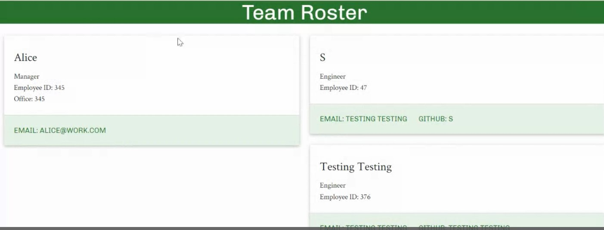

# genTeamProfile

## Description
This is a Node.js command-line application that takes in information about employees on a software engineering team and generates an HTML webpage that displays summaries for each person.

### Languages used:
- HTML
- CSS
- JavaScript
- Node
- ES6

## Table of Contents:
- [Instructions for Installation](#instructions-for-installation)
- [Usage](#usage)
- [Contribution Guidelines](#contribution-guidelines)
- [Questions?](#questions?)

## <a name="instructions-for-installation">Instructions for Installation</a>:
This application requires installation of the npm module, "Inquirer". Enter "node index" in the command line to run.

    

## <a name="usage">Usage</a>:

[*Click the image-link to access a video walkthrough of the application:*](https://drive.google.com/file/d/1qlHMAsmjg06ReGYEeunBg6EfI_EYSDn8/view)

    
## <a name="contribution-guidelines">Contribution Guidelines</a>:
Made with ☕+❤️ by Sara Krizan and in consultation with several LAs, TA, and learning instructor through the University of Wisconsin Extended Campus Coding Bootcamp.

## <a name="questions?">Questions?</a>
Sara Krizan
[GitHub](https://github.com/SMKrizan)
    